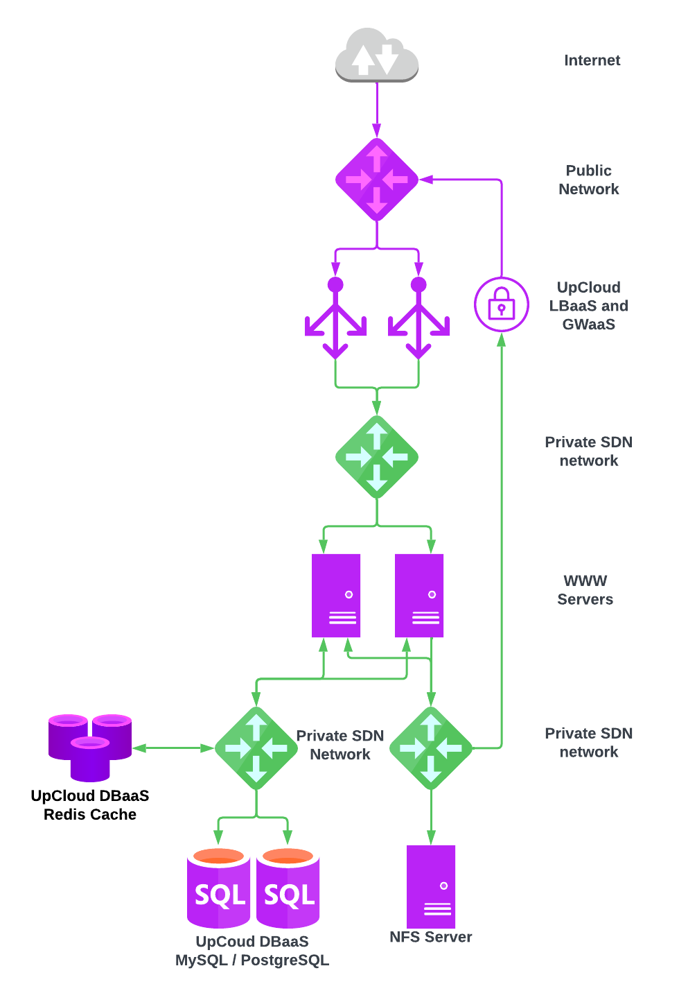

# simple-custom-module-example
This is simple example of how to build HA web cluster in Terraform with UpCloud provider. In this example we create web cluster with WWW servers, NFS server and DBaaS.



### Prerequisites

Project uses [Terraform](https://www.terraform.io/) and should be installed. We're also using UpCloud's Terraform provider, but it should be automatically installed by running `terraform init`.

To create the resources with Terraform, you'll need your API credentials exported.

```
export UPCLOUD_USERNAME=your_username
export UPCLOUD_PASSWORD=your_password
```

You must also create `config.tfvars` file with your own settings:
 
```
zone = "pl-waw1"
www_plan = "1xCPU-1GB"
nas_plan = "4xCPU-8GB"
dbaas_plan = "2x2xCPU-4GB-50GB"
lbaas_plan = "production-small"
nas_network = "10.20.0.0/24"
lb_network = "10.20.10.0/24"
ssh_key_public = "ssh-rsa AAAA_YOUR_SSH_PUBLIC_KEY"
```

### Quickstart

**IMPORTANT: Make sure your SSH-agent is running (execute this if not: `eval$(ssh-agent) && ssh-add <path_to_private_key> && ssh-add -L`), so Terraform scripts can SSH into VMs using agent forwarding**

### Creating services with basic configuration

Initiate the project and install providers.

```
make init
```

Demo can now be created with Terraform. Creation takes around 10-15 minutes.

```
make create
```

### Destroying stuff

After testing things its good to free the resources. Tearing the thing down is also just one command.

```
make destroy
```